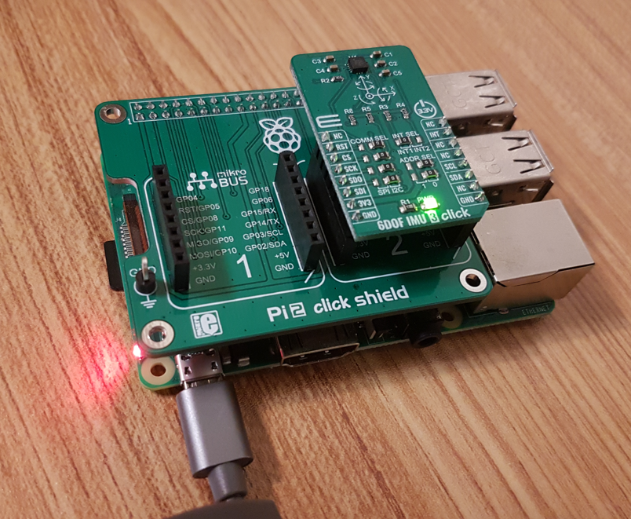
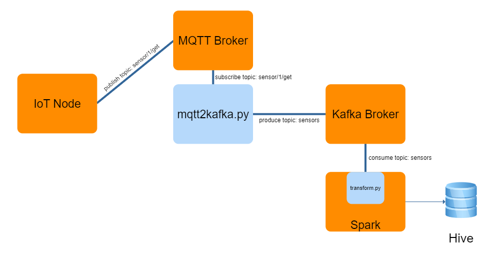
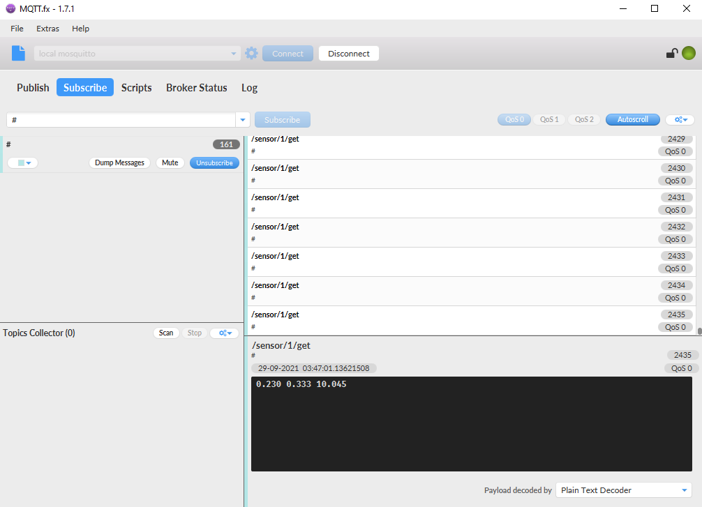

# bdt-final-project
Spark Streaming project using IoT Sensor Data

`IoT node -> MQTT Broker -> mqtt2kafka -> kafka -> spark -> hive`

- Student: Ganzorig Ulziibayar
- Course: Big Data Technology
- Professor: Mrudula Mukadam
- VIDEO LINK: https://web.microsoftstream.com/video/7124b236-af89-4738-9938-e5cf42bea335

**Table of Contents**
1. [Overview](#overview)
2. [Requirements](#requirements)
    1. [Software](#software)
    1. [Hardware](#hardware)
3. [Project detail](#project-detail)

# Overview

IoT is said to be the next big thing like the internet in the past. There will be billions of devices connected. And it produces massive data. So in this project, I did proof of concept of how we can use apache spark to receive these iot data and process it to get some valuable insights. 

For this purpose, I have used raspberry pi as edge iot device which has IMU sensor reporting acceleration data in X, Y, Z directions. 



In short, data will flow in following manner.



[MQTT](https://mqtt.org/) is the simple, lightweight tcp based protocol used for transferring data. Of course, we can add more security by using ssl, authorization using credentials. But for simplicity, I have ommitted security layer. MQTT operates very much similar to kafka. There is a concept publisher, subcriber. It is analogous to producer, consumer. And there is topic. 

**Spark Streaming - Earthquake analysis**. </br>
Each acceleration data is between -9.81 [m/s2] to 9.81 [m/s2] range. Our sensor has bit offset from manufacturing. When the sensor is stationary, Z acc is 10.062. if we tilt it sideways, X, Y acc will change. So based on this, we can do some transformation on the data, determine if there is earthquake happening. if X, Y axis changes in certain degree, we can say that there is an earthquake. 

Project Tasks:
- **`[1]`** Create your own project for Spark Streaming</br>
*Real Sensor data is generated from Raspberry pi, and this data will be transferred to spark via MQTT broker, Kafka broker. And using this data, system will evaluate whether earthquake is happenning.*
- **`[2]`** Integrate Hive with Part 1 </br>
*Result of the process is stored on `hive`.*
- **`[3]`** Create a simple demo project for any of the following tools: Kafka </br>
*Main project uses kafka.*
- **`[4]`** Record a demo of your Presentation of all the above 3 parts.</br>
*[Recorded demo](https:example.com)*


# Requirements

## Software:
| Name | Version |
| - | - |
| Ubuntu | 20.04 | 
| Mosquitto | 2.0.12 |
| Python | 3.6.7 |
| Scala | 2.11.12 |
| Hadoop | 2.8.5 | 
| Hive | 2.3.5 |
| Kafka (For Hadoop2) | 2.12 |
| Spark (For Hadoop2) | 3.1.1 |

Python requirements:

| Package | Version |
| - | - |
| pyspark | 3.7.12 |
| kafka-python | 2.0.2 |

There can be some incompatibilites because of the software versions. Therefore, it is recommended to use following versions. 

Download spark streaming to kafka util from 
https://search.maven.org/search?q=a:spark-streaming-kafka-0-8-assembly_2.11

Hive Installer
http://archive.apache.org/dist/hive/hive-2.3.5/

Hadoop2
https://www.apache.org/dyn/closer.lua/spark/spark-3.1.2/spark-3.1.2-bin-hadoop2.7.tgz

Kafka:
https://kafka.apache.org/downloads

Hadoop2
https://hadoop.apache.org/release/2.8.5.html

## Hardware:
1. [Raspberry pi](https://www.raspberrypi.org/) 
2. [IMU Click Sensor](https://www.mikroe.com/6dof-imu-3-click)


# Project detail:
### Commands for start and stop services

Please make sure do following steps to run the project.
1. Install Mosquitto (MQTT Broker) and configure
[mosquitto](https://mosquitto.org/download/)

Add following lines in the `mosquitto.conf`. 
```
listener 1883 0.0.0.0 # So that mosquitto can listen from other devices.
allow_anonymous true # no authentication required
```
Note: I have run the mosquitto broker on windows machine. Make sure enable port 1883 in your firewall setting.

2. start kafka
```
sudo systemctl start kafka // stop
```

Create a Topic "sensors" in kafka
```
./kafka-topics.sh --create --bootstrap-server localhost:9092 --replication-factor 1 --partitions 1 --topic sensors
```

Check if it is created in kafka
```
kafka@ubuntu:~/kafka/bin$ ./kafka-topics.sh --list --bootstrap-server localhost:9092
__consumer_offsets
sensors
```
3. Start hadoop
```
hdfs namenode -format
start-dfs.sh
```
Following directories should be created for hive.
```
hadoop fs -mkdir -p /user/hive/warehouse
hadoop fs -mkdir -p /tmp
hadoop fs -chmod g+w /user/hive/warehouse
hadoop fs -chmod g+w /tmp
```

4.  Start Hive MetaStore 
```
hive --service metastore
```

5. Create Hive Table
```
hive> CREATE TABLE sensors (text STRING, sentiment DOUBLE)
    > ROW FORMAT DELIMITED FIELDS TERMINATED BY '\\|'
    > STORED AS TEXTFILE;
```
### 

After this, our environment is ready. And we can start running our project code.

Firstly, iot sensor node code should run. 
```
python iot_sensor.py
```
As soon as you execute, following will be printed to console. These are acceleration value of X, Y, Z axis. `Connected to broker` means node is connected to MQTT broker running on the host PC and successfully publish data into topic `/sensor/1/get/`. Inside the topic, there is index 1 which identifies the actual node. There can be thousands of nodes.

Using the [mqtt-client-tool](https://mqttfx.jensd.de/index.php/download), it can verified whether sensor data is correctly published to MQTT broker.



```
pi@raspberrypi:~/projects/iot $ python iot_sensor.py
Connecting to Adafruit IO...
Connected to Broker! Listening for topic changes on /sensor/1/set
Acceleration (m/s^2): (0.266, 0.340, 10.083)
Sent!
Acceleration (m/s^2): (0.225, 0.306, 10.062)
Sent!
```

Secondly, we need to inject this data into spark via kafka. mqtt2kafka.py script is written, so that i subscribes to topic /sensor/1/get/ and as soon as data arrives, it produces the message to kafka.

```
python3 mqtt2kafka.py
```
If we run provided consumer shell, following should be printed on the console.
```
~/kafka/bin/kafka-console-consumer.sh --bootstrap-server localhost:9092 --topic sensors
0.117 -0.493 10.074 2021-09-29 23:10:13
0.141 -0.529 10.086 2021-09-29 23:10:15
0.172 -0.593 10.081 2021-09-29 23:10:17
0.124 -0.522 10.091 2021-09-29 23:10:19
```

Afterwards, data is in the kafka, we can consume this data, do the proper transformation and store the result on the hive.

```
spark-submit --jars spark-streaming-kafka-0-8-assembly_2.11-2.4.8.jar transform.py
```
```
Earthquake!...
Earthquake!...
+---+----+----+-------------------+
|  x|   y|   z|                  t|
+---+----+----+-------------------+
|-25|-936| 401|2021-09-29 23:11:40|
| 13| -52|1008|2021-09-29 23:11:42|
| 13| -55|1008|2021-09-29 23:11:44|
+---+----+----+-------------------+

```
Note: if absolute value of x or y value reaches above 500, there is tilt in that direction, and message Earthquake is printed.

